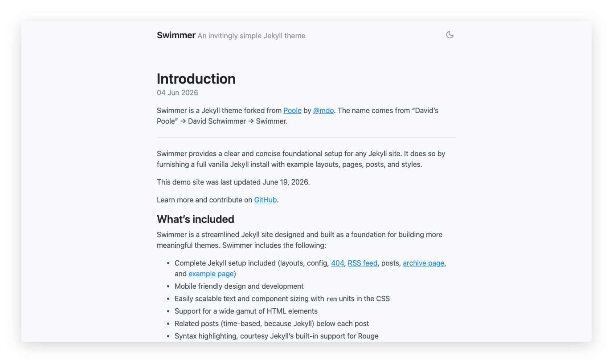
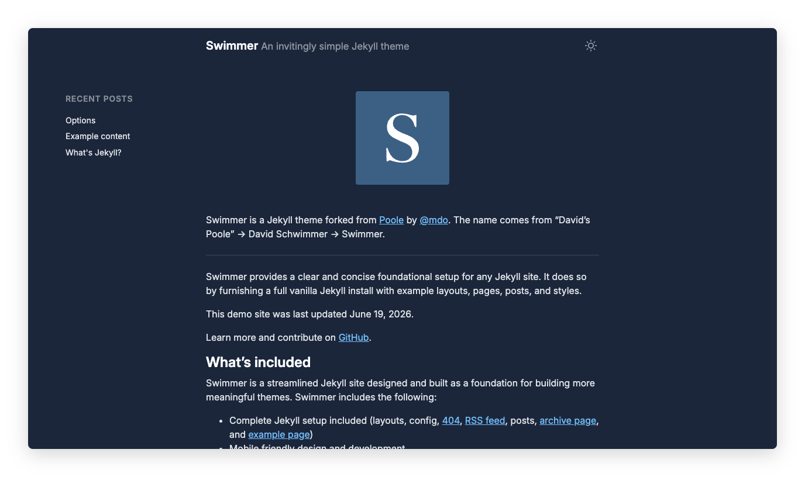

# Swimmer

Swimmer is an opinionated yet invitingly simple Jekyll theme that extends and builds off of [Poole](https://getpoole.com), the foundational Jekyll setup by [@mdo](https://twitter.com/mdo). The name comes from "David's Poole" &rarr; David Schwimmer &rarr; Swimmer.

Poole provides a clear and concise foundation for any Jekyll site. Swimmer takes that foundation and adds a dedicated landing page, mobile sidebar, dual-mechanism dark mode, self-hosted variable fonts, and Tailwind CSS v4 styling.

See it live at [swimmer.dsillman.com](https://swimmer.dsillman.com).

<p>
  
  
</p>

## Features

- **Dedicated landing page** — `index.md` serves as a standalone homepage with logo, not a paginated post listing
- **Minimalist masthead** — just site title, tagline, and dark mode toggle; no navigation bar
- **Post sidebar** — hamburger-triggered overlay on mobile, fixed-position list on desktop (≥75rem), showing the 10 most recent posts and any related posts
- **Dark mode** — respects `prefers-color-scheme`, offers a manual toggle (sun/moon icons), persists preference in `localStorage`, and prevents flash of wrong theme
- **Self-hosted variable fonts** — Inter (body) and Roboto Mono (code), preloaded as WOFF2
- **Tailwind CSS v4** — modular CSS via `@tailwindcss/cli`, compiled to a single minified `styles.css`
- **Syntax highlighting** — Rouge with separate light and dark color schemes
- **Archive page** — posts grouped by month/year
- **Atom/RSS feed** — built-in `atom.xml`
- **SEO** — `jekyll-seo-tag` integrated in `<head>`

## Contents

- [Usage](#usage)
- [Development](#development)
- [Author](#author)
- [License](#license)


## Usage

### 1. Install dependencies

```bash
$ make install
```

This runs `bundle install` and `npm install`. You'll need Ruby 3.3.0, Bundler, and Node (managed via fnm).

### 2. Running locally

```bash
$ make serve
```

Open <http://localhost:4000> in your browser. The CSS will rebuild on changes automatically.

### 3. Production build

```bash
$ make build
```

Output goes to `_site/`.

### 4. Serving it up

Push your repo to GitHub and use [GitHub Pages](https://pages.github.com) to host. Verify the `baseurl` option in `_config.yml` and `CNAME` if using a custom domain.

## Development

CSS lives in `_css/` as modular files compiled into `styles.css`. Edit the source files in `_css/`, then run `make css` (or use `make serve` for auto-rebuild).

To regenerate screenshots:
```bash
$ make screenshots
```

## Credits

Swimmer extends and builds off of [Poole](https://getpoole.com), the foundational Jekyll setup by [@mdo](https://twitter.com/mdo). The original Poole project also produced the [Hyde](https://hyde.getpoole.com) and [Lanyon](https://lanyon.getpoole.com) themes.

## Author

**David Sillman** — [dsillman.com](https://www.dsillman.com) · [GitHub](https://www.github.com/dsillman2000)

Originally built as [Poole](https://getpoole.com) by **Mark Otto** ([@mdo](https://github.com/mdo)).


## License

Open sourced under the [MIT license](LICENSE.md).
